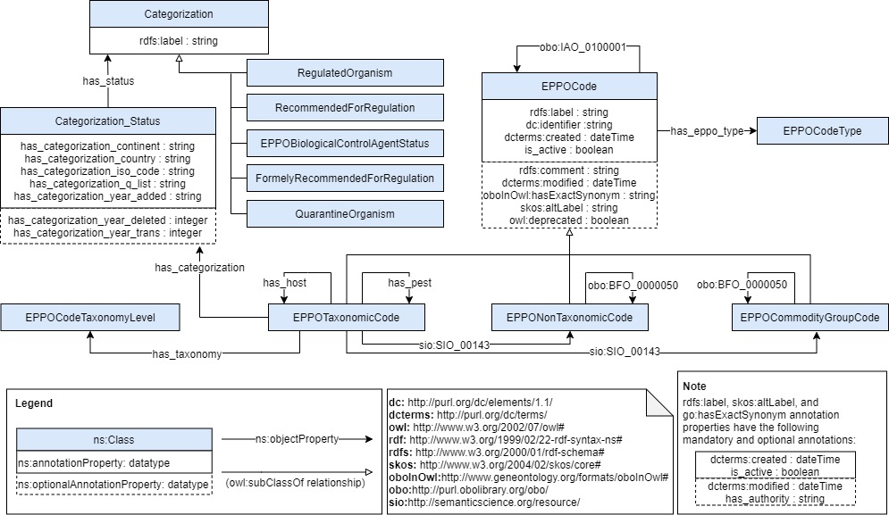

# EPPO Ontology

## Purpose and scope

The EPPO ontology aims to represent the information available in the [EPPO Global database](https://gd.eppo.int/) and the relationships between the concepts identified therein. Therefore, this ontology is not limited to be used by a specific application, but has been developed in the interest of having a single, harmonized, and flexible source of the EPPO code system information.

The scope of the vocabulary include taxonomic and non-taxonomic codes along with their code types, parent-child relationship per code, phytosanitary categorization, and their taxonomy level (if applicable). Further details on the information available in taxonomic and non-taxonomic classifications is presented in the following figure:

<p align="center">
 
</p>

## Ontology development methodology
This ontology was developed according to the development lifecycle and guidelines proposed in the [BASF Governance Operational Model for Ontologies (GOMO)](https://zenodo.org/record/7007495#.ZFkjyxHP2Uk).

### Requirements
The requirements can be found [here](https://github.com/basf/EPPOontology/blob/main/requirements/requirements.xlsx), and are specified with an identifier, competency question and expected answer.

### Ontology model

This conceptual model shows a general overview of the classes and properties of the ontology. This model is depicted as a diagram which follows the [Chowlk notation](https://chowlk.linkeddata.es/notation.html).

<p align="center">
 
</p>

Note that, due to the large number of terms contained in the EPPO Global database, this diagram only shows the main classes and properties represented in the ontology, but the ontology file contains all the hierarchical classifications included in the database for each class depicted in the diagram.

### Ontology (OWL)

The encoded ontology in the Web Ontology Language (OWL) can be found [here](https://github.com/basf/EPPOontology/blob/main/ontology/eppo.zip).

## Contribute
Contributions to improve the ontology or address any issues are welcome.
The management of issues and improvements suggested for this ontology is done by addressing [issues](https://github.com/basf/EPPOontology/issues) in the repository. In order to push your contribution, just push your pull request to the develop branch. The master branch has only the code associated to the latest release.

## Citing

If you used the EPPO ontology in your work, please cite the [Frontiers in Artificial Intelligence](https://www.frontiersin.org/articles/10.3389/frai.2023.1131667) paper:
```bib
@ARTICLE{10.3389/frai.2023.1131667,

AUTHOR={Ayllón-Benitez, Aarón and Bernabé-Diaz, José Antonio and Espinoza-Arias, Paola and Esnaola-Gonzalez, Iker and Beeckman, Delphine S. A. and McCaig, Bonnie and Hanzlik, Kristin and Cools, Toon and Castro Iragorri, Carlos and Palacios, Nicolás},   

TITLE={EPPO ontology: a semantic-driven approach for plant and pest codes representation},      

JOURNAL={Frontiers in Artificial Intelligence},      

VOLUME={6},           

YEAR={2023},      

URL={https://www.frontiersin.org/articles/10.3389/frai.2023.1131667},       

DOI={10.3389/frai.2023.1131667}
}
```


## Authors
* Aarón Ayllón-Benitez - [aaron.ayllon@basf.com](mailto:aaron.ayllon@basf.com)
* José Antonio Bernabé-Diaz - [jose-antonio.bernabe-diaz@basf.com](mailto:jose-antonio.bernabe-diaz@basf.com)
* Paola Espinoza-Arias - [paola.espinoza@basf.com](mailto:paola.espinoza@basf.com)
* Iker Esnaola-Gonzalez - [iker.esnaola@basf.com](mailto:iker.esnaola@basf.com)
* Delphine S.A. Beeckman - [delphine.beeckman@basf.com](mailto:delphine.beeckman@basf.com)
* Bonnie McCaig - [bonnie.mccaig@basf.com](mailto:bonnie.mccaig@basf.com)
* Kristin Hanzlik - [kristin.hanzlik@basf.com](mailto:kristin.hanzlik@basf.com)
* Toon Cools - [toon.cools@partners@basf.com](mailto:toon.cools@partners.basf.com)
* Carlos Castro Iragorri
* Nicolás Palacios

BASF, May 2023 - Present
